# Тестування працездатності системи

Тестування сервісу проводилося за допомогою Postman.

## GET Comment

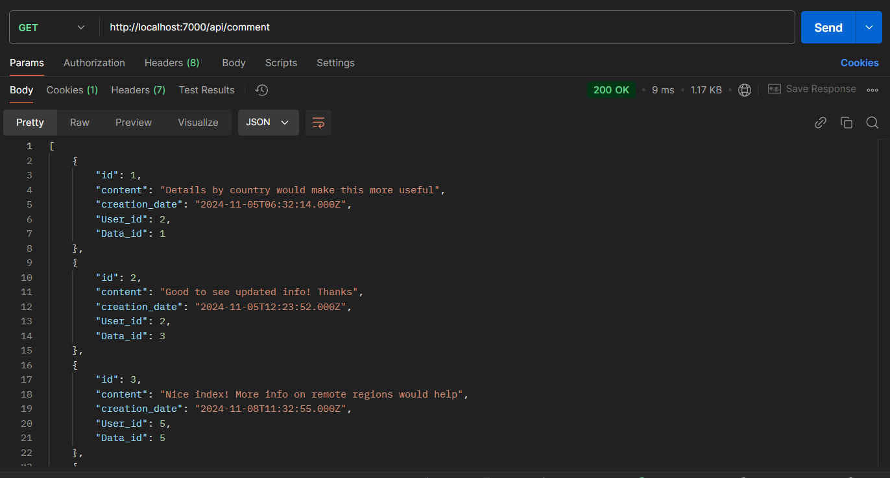

## GET Comment/id

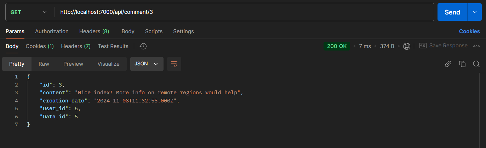

## POST Comment

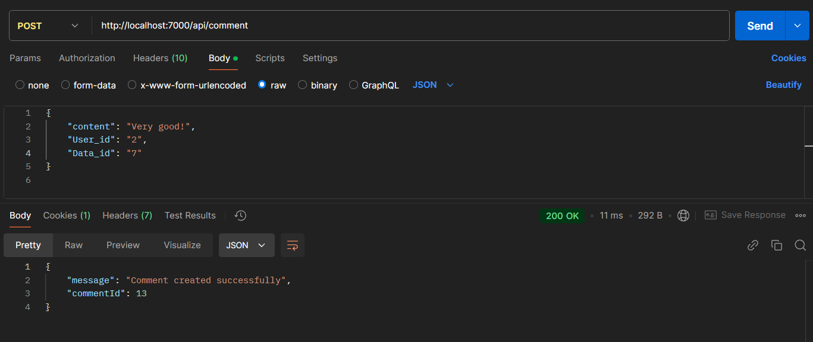

## DELETE Comment/id

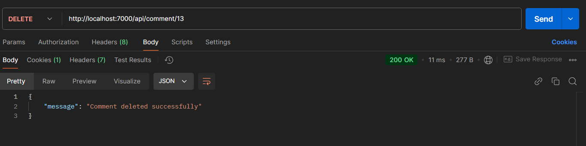

## GET Data

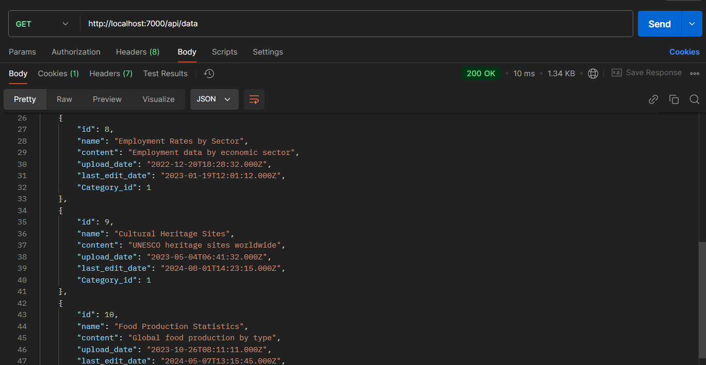

## GET Data/id

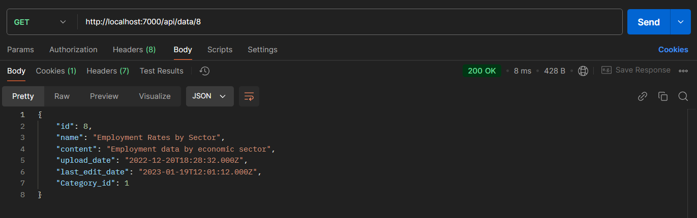

## POST Data

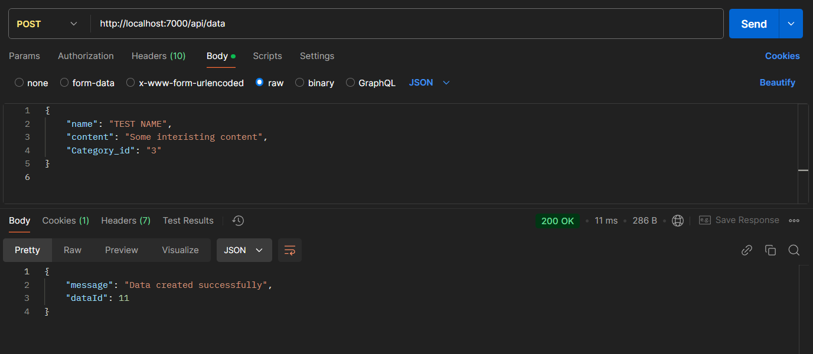

## UPDATE Data/id

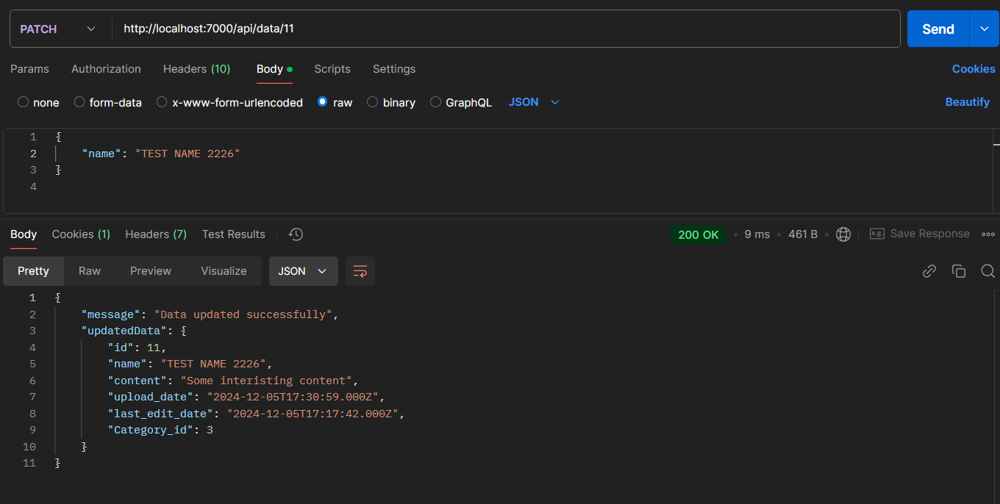

## DELETE Comment/id

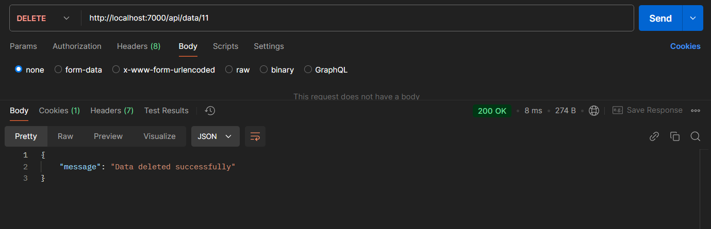

___ 

# EXCEPTIONS

## Comment not found

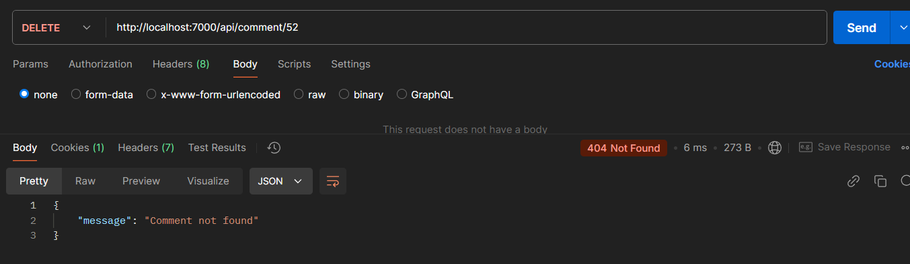

## Required data missing

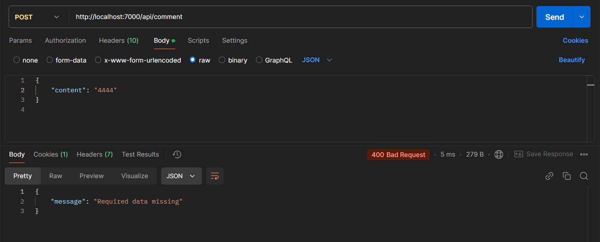

## Data not found

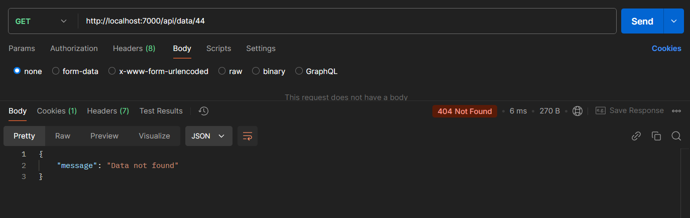

## No fields to update

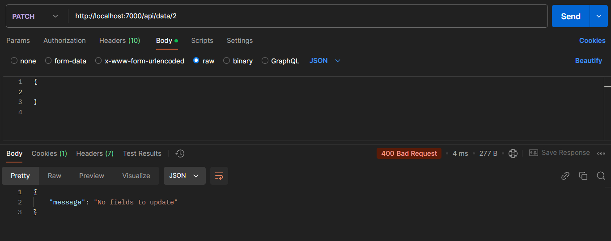
